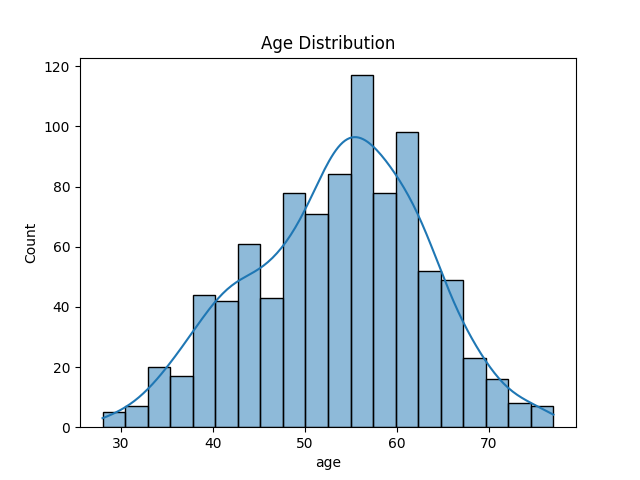
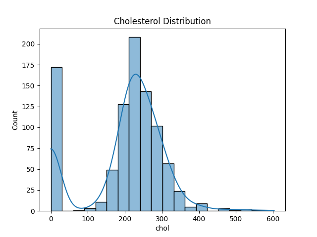
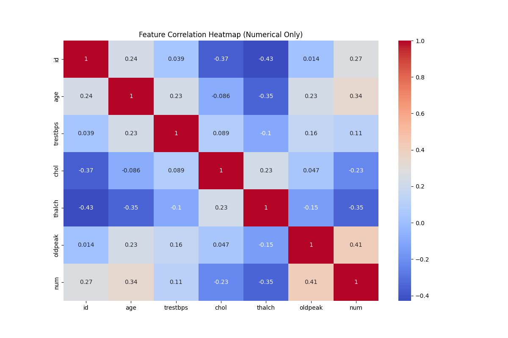

# 🫀 Heart Disease EDA (Task 5)

This repository contains an Exploratory Data Analysis (EDA) project on a heart disease dataset. The goal is to uncover trends, correlations, and anomalies that could help in understanding the factors contributing to heart disease.

---

## 📌 Objective

Perform statistical and visual exploration on a multivariate medical dataset related to heart disease to:
- Analyze the distribution of patient attributes
- Identify key features linked to heart disease
- Visualize trends and correlations between variables

---

## 📊 Dataset

**Source**: [Kaggle - Heart Disease Data](https://www.kaggle.com/datasets/redwankarimsony/heart-disease-data)

- **Total records**: 920 patients
- **Attributes**: 15 columns including age, cholesterol, chest pain type, heart rate, and target variable `num` (presence of heart disease)

---

## 🛠️ Tools Used

- Python 3.x
- Pandas
- Seaborn
- Matplotlib
- WSL (Ubuntu)
- VS Code

---

## 📁 File Structure
```bash
heart-disease-eda/
├── Dataset/
│ └── heart_disease_uci.csv
├── plots/
│ ├── age_distribution.png
│ ├── chol_distribution.png
│ └── heatmap.png
├── eda_heart_disease.py
├── requirements.txt
└── README.md
```

---

## 🧪 Key EDA Steps

- Handled missing values (numerical: median, categorical: mode)
- Visualized distributions with histograms
- Plotted correlation heatmap
- Printed summary statistics and categorical distributions

---

---

## 🖼️ Sample Visualizations

### 📌 Age Distribution


### 📌 Cholesterol Distribution


### 📌 Feature Correlation Heatmap


All plots are saved in the `plots/` directory.

---

## ▶️ How to Run

### 1. Clone the repository:
```bash
git clone https://github.com/your-username/heart-disease-eda.git
cd heart-disease-eda
```

### 2. Create and activate virtual environment:
```bash
python3 -m venv venv
source venv/bin/activate
```
### 3. Install dependencies:
```bash
pip install -r requirements.txt
```
### 4. Run the EDA script:
```bash
python3 eda_heart_disease.py
```
Plots will be saved inside the plots/ folder.

## 📌 Future Work

Apply ML models for prediction

Build a dashboard using Streamlit or Tableau

