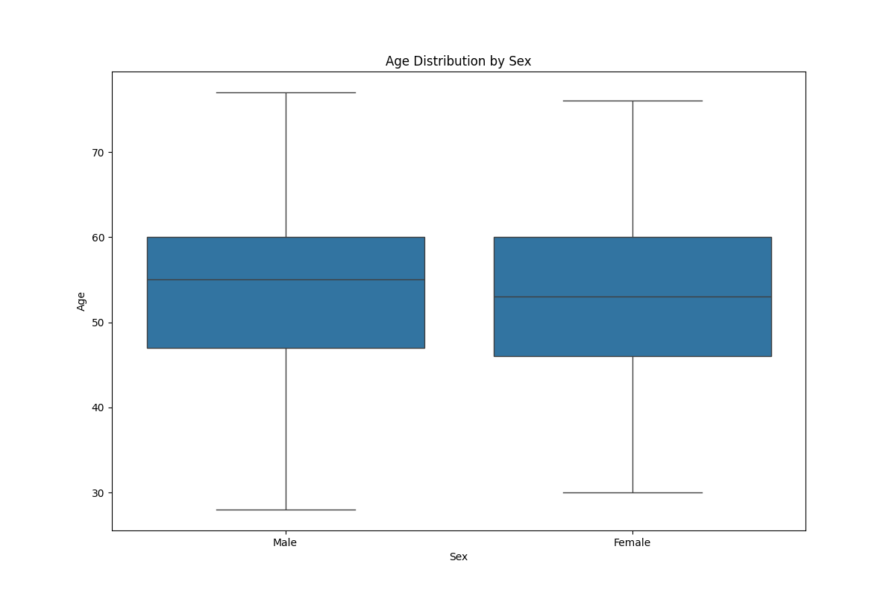

# 🫀 Heart Disease EDA (Task 5)

This repository contains an Exploratory Data Analysis (EDA) project on a heart disease dataset. The goal is to uncover trends, correlations, and anomalies that could help in understanding the factors contributing to heart disease.

---

## 📌 Objective

Perform statistical and visual exploration on a multivariate medical dataset related to heart disease to:
- Analyze the distribution of patient attributes
- Identify key features linked to heart disease
- Visualize trends and correlations between variables

---

## 📊 Dataset

**Source**: [Kaggle - Heart Disease Data](https://www.kaggle.com/datasets/redwankarimsony/heart-disease-data)

- **Total records**: 920 patients
- **Attributes**: 15 columns including age, cholesterol, chest pain type, heart rate, and target variable `num` (presence of heart disease)

---

## 🛠️ Tools Used

- Python 3.x
- Pandas
- Seaborn
- Matplotlib
- WSL (Ubuntu)
- VS Code

---

## 📁 File Structure
```bash
heart-disease-eda/
├── Dataset/
│ └── heart_disease_uci.csv
├── plots/
│ ├── age_distribution.png
│ ├── chol_distribution.png
│ └── heatmap.png
├── eda_heart_disease.py
├── requirements.txt
└── README.md
```

---

## 🧪 Key EDA Steps

- Handled missing values (numerical: median, categorical: mode)
- Visualized distributions with histograms
- Plotted correlation heatmap
- Printed summary statistics and categorical distributions

---

---

## 🖼️ Sample Visualizations

### 📌 Age Distribution


### 📌 Cholesterol Distribution


### 📌 Feature Correlation Heatmap


### 📦 Boxplots
#### Cholesterol vs Chest Pain Type


#### Age vs Sex


### 📈 Scatterplots
#### Age vs Max Heart Rate (by disease status)


#### Cholesterol vs ST Depression (by disease status)


All plots are saved in the `plots/` directory.

---

---

## 📊 EDA Observations & Insights

### 🔍 1. Age Distribution
- Most patients fall between **45 and 65 years** of age.
- Distribution is roughly **normal with a slight right skew**.
- Suggests that **middle-aged and older adults** are more commonly affected by heart disease.

### 🔍 2. Cholesterol Distribution
- Cholesterol values mostly lie between **200–250 mg/dL**, but a suspicious spike at **0 mg/dL** suggests **invalid entries or missing data**.
- Distribution is **right-skewed with multiple outliers**, going up to 600 mg/dL.
- Cholesterol levels vary drastically between individuals, and extreme values warrant further investigation.

### 🔍 3. Correlation Heatmap
- **`oldpeak`** (ST depression) shows a **moderate positive correlation** with heart disease presence (`num`).
- **`thalch`** (max heart rate) shows a **moderate negative correlation** with disease presence.
- Other numerical variables have weak correlations.
- Indicates that **ST depression and max heart rate** may be valuable predictors for ML modeling.

### 🔍 4. Boxplot: Cholesterol vs Chest Pain Type
- Patients with **asymptomatic chest pain** have the **widest cholesterol range** and the most **extreme outliers**.
- Those with **typical angina** have a **lower median cholesterol** level.
- Chest pain type correlates with risk indicators like cholesterol.

### 🔍 5. Boxplot: Age vs Sex
- **Males slightly outnumber females** and have a **slightly higher median age**.
- Overall age distribution between sexes is **very similar**.
- No significant sex-based bias in age distribution.

### 🔍 6. Scatterplot: Age vs Max Heart Rate (by Disease Status)
- As **age increases**, **maximum heart rate decreases**, especially in patients diagnosed with heart disease.
- Patients with heart disease tend to cluster in **lower thalach (heart rate)** values.

### 🔍 7. Scatterplot: Cholesterol vs ST Depression (by Disease Status)
- Higher **ST depression (`oldpeak`)** and higher **cholesterol** often appear together in patients with heart disease.
- Healthy individuals mostly cluster in **low oldpeak and average cholesterol** ranges.

---

## 🧾 Summary of Findings

- Patients in this dataset are predominantly **middle-aged males**.
- **Oldpeak, chest pain type, and thalach** emerged as key variables in distinguishing heart disease presence.
- **Cholesterol values require cleaning** (e.g., removing or imputing 0 values).
- **Multivariate interactions** like **high cholesterol + high ST depression** or **low heart rate + older age** are strong indicators of disease.
- These findings provide valuable direction for feature selection in further predictive modeling.

---


## ▶️ How to Run

### 1. Clone the repository:
```bash
git clone https://github.com/your-username/heart-disease-eda.git
cd heart-disease-eda
```

### 2. Create and activate virtual environment:
```bash
python3 -m venv venv
source venv/bin/activate
```
### 3. Install dependencies:
```bash
pip install -r requirements.txt
```
### 4. Run the EDA script:
```bash
python3 eda_heart_disease.py
```
Plots will be saved inside the plots/ folder.

## 📌 Future Work

Apply ML models for prediction

Build a dashboard using Streamlit or Tableau

